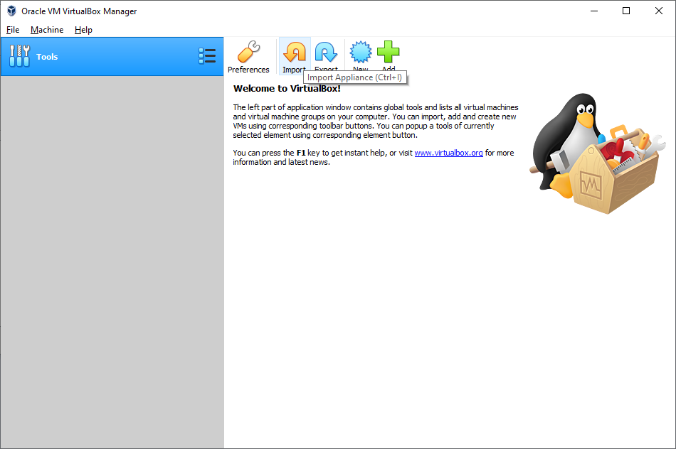
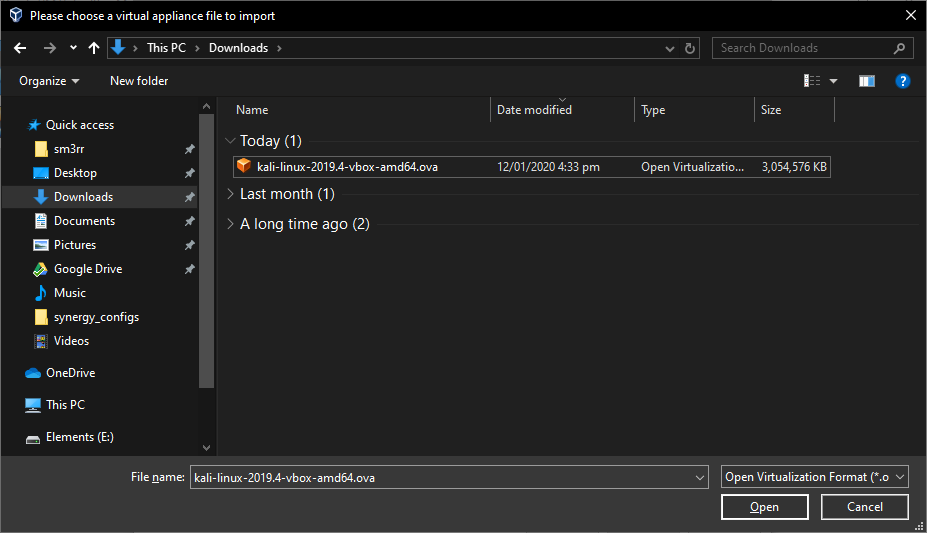
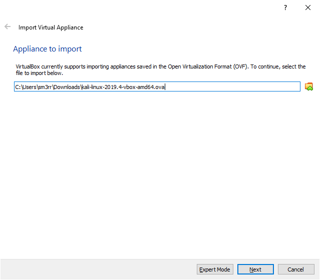
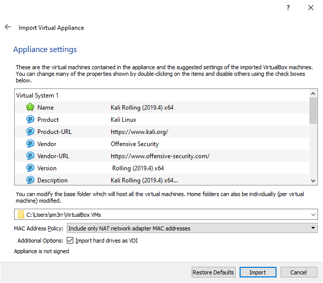
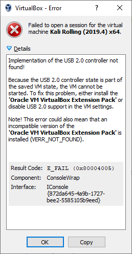
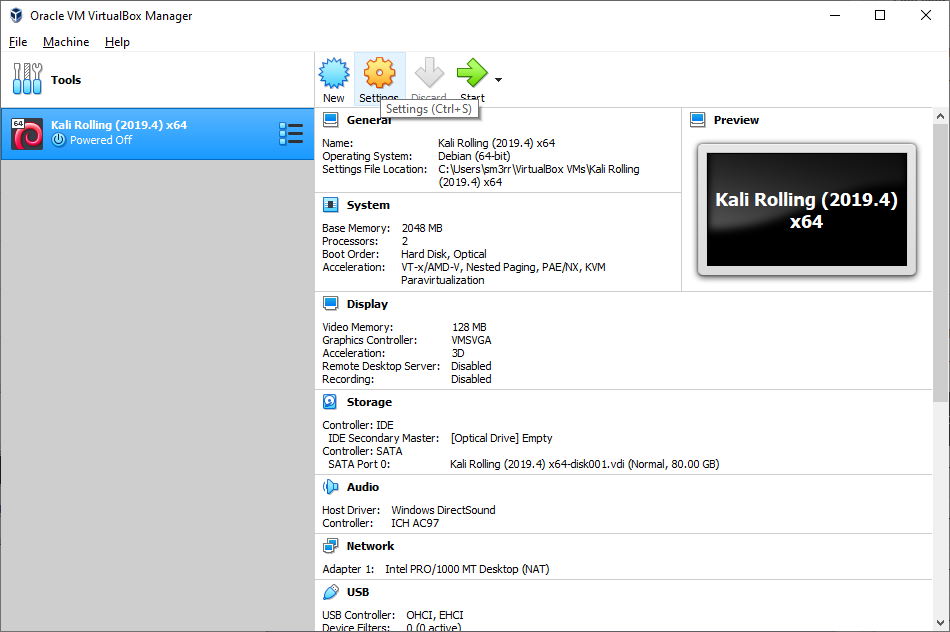
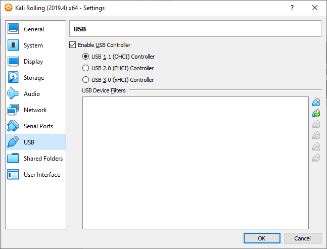
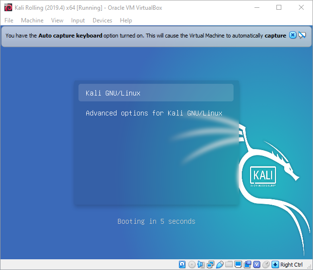
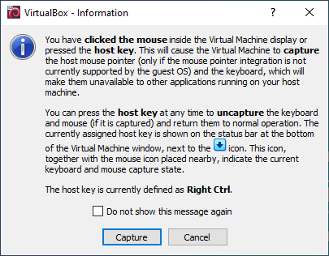
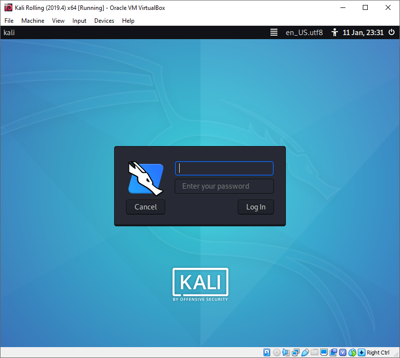

# Setting Up Kali Linux with Virtualbox

Kali linux is a debian based linux distribution which comes preinstalled with hundreds of tools designed for penetration testing.

While these tools are readily available on most distributions, kali linux is the fastest and easiest way to get started.

The kali images we will use are ready to use, prebuilt, virtual machine images from the official kali website. This saves us the the effort of installing kali from scratch in a virtual machine.

## Steps to install

1. Downlaod and install Oracle Virtualbox
https://www.virtualbox.org/wiki/Downloads

2. Download Kali Linux Virtualbox Appliance
https://www.offensive-security.com/kali-linux-vm-vmware-virtualbox-image-download/#1572305786534-030ce714-cc3b

4. Import Kali Linux to virtualbox
  - Click **Import**. 
  - Find the downloaded image and click **Open**. 
  - Click **Next**. 
  - Click **Import** to accept the default settings. You can modify settings such as CPU and Memory limits here or you can do it in the settings later. 
  - Wait for the appliance to finish importing. 
  - If you attempt to start the image now you may see the following error message. . In this case, open settings. 
  - Go to 'USB', change the USB controller `USB 1.1 (CHCI) Controller` and click **Ok**. 

5. Start the virtual machine. 

6. Press **&lt;enter&gt;** to select `Kali GNU/Linux` (hightlighed). 

7. If you are presented with a pop up like this Click **Capture**. 

8. Login to the virtual machine 

For kali 2019.4

**Username:** `root` 
**Password:** `toor` 

for kali 2020.1

**Username:** `kali` 
**Password:** `kali` 

9. [Setup nat networking](setup-nat-network.md) and set the VM to use the Nat Network.

10. [Enable the eth0 interface for Kali Linux](kali-enable-eth0.md)

**Welcome to kali linux**

*'The quieter you become, the more you are able to hear"*
